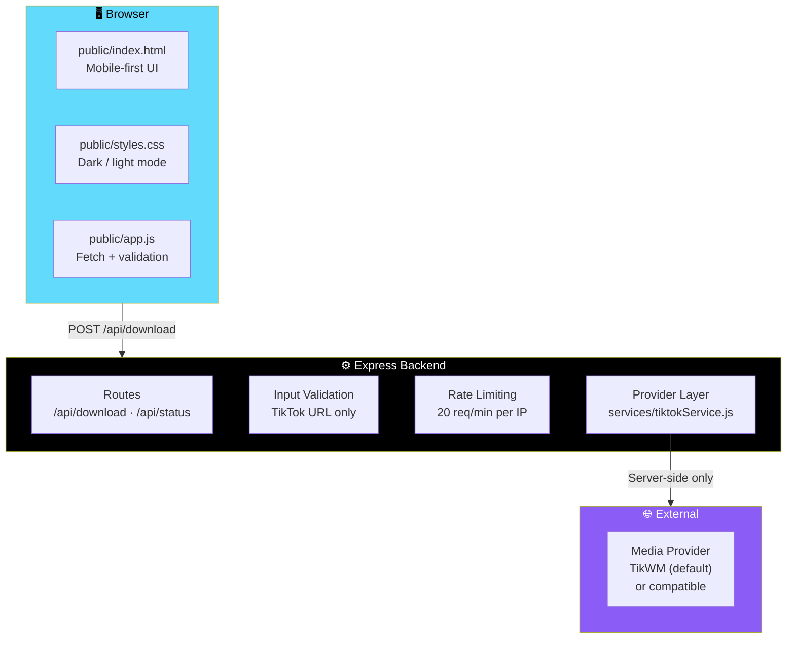

# 📥 TikSave — TikTok Video Downloader

<div align="center">


**A fast, mobile-first TikTok video downloader.**

*Clean SaaS-style UI · Express backend · Live media provider · No mock data*

[✨ Features](#-features) • [🏗️ Architecture](#-architecture) • [🚀 Getting Started](#-getting-started) • [📡 API](#-api) • [🔐 Security](#-security-notes)

</div>

---

## 📖 Overview

**TikSave** is a **fast, mobile-first TikTok video downloader** with a clean SaaS-style UI and an **Express backend backed by a live media provider**.

### Core Idea

> **Paste a link. Get a video.**
>
> The backend does not return mock metadata — provider failures are reported to the user honestly, and **no fake download links are generated.**

---

## ✨ Features

<div align="center">

| 📋 Paste-a-Link Flow | 🎬 Video Preview Card |
|:---:|:---:|
| Client- and server-side validation | Thumbnail · author · title · duration · download options |
| **⏳ Loading States** | **🔔 Toast Notifications** |
| Spinner · skeleton · disabled button while processing | Success and error feedback |
| **📋 Copy & Clear** | **🌗 Dark / Light Mode** |
| Copy-link and reset actions | Responsive mobile-first layout with hamburger nav |
| **♿ Accessible** | **🛡️ Security Basics** |
| Semantic HTML · visible focus states · `prefers-reduced-motion` support | Input validation · rate limiting · request size limits · CORS · **no open proxy / SSRF surface** |
| **🔌 Abstracted Provider** | **🚫 No Fake Data** |
| Swap in a compatible provider without touching routes or frontend | Provider failures are reported honestly — no fake download links |

</div>

### Detailed Feature List

#### 🎯 Downloader Flow

- **Paste-a-link** flow with both client- and server-side validation
- **Video preview card** showing:
  - Thumbnail
  - Author
  - Title
  - Duration
  - Download options

#### 🎨 UI/UX

- **Loading spinner** while processing
- **Skeleton loading state** for the preview card
- **Disabled button** during processing
- **Error and success states**
- **Toast notifications**
- **Copy-link** and **clear/reset** actions
- **Dark/light mode toggle**
- **Responsive mobile-first layout** with hamburger nav

#### ♿ Accessibility

- **Semantic HTML**
- **Visible focus states**
- **`prefers-reduced-motion` support**

#### 🔌 Provider Abstraction

- **`services/tiktokService.js`** — swap in a compatible provider **without touching routes or frontend**

#### 🛡️ Security Basics

- **Input validation**
- **Rate limiting**
- **Request size limits**
- **CORS**
- **No open proxy / SSRF surface**

---

## 🏗️ Architecture



### Project Structure

```
tiktok-downloader/
├── public/
│   ├── index.html
│   ├── styles.css
│   └── app.js
├── services/
│   └── tiktokService.js
├── server.js
├── package.json
├── .env.example
├── .gitignore
└── README.md
```

### Layered Design

| Layer | Responsibility |
|-------|---------------|
| **`public/`** | The entire frontend — HTML, CSS, and vanilla JS |
| **`services/tiktokService.js`** | The provider abstraction — the only file that talks to an external media provider |
| **`server.js`** | Express app, routes, security middleware |

> 💡 **Because the provider is abstracted, swapping it out never touches routes or frontend code.**

---

## 🚀 Getting Started

```bash
npm install
cp .env.example .env
npm start
```

Visit **`http://localhost:3000`**.

### ⚙️ Default Configuration

The default configuration uses the **live TikWM API**.

> ⚠️ **The backend does not return mock metadata.** Provider failures are reported to the user, and no fake download links are generated.

---

## 🔌 Connecting a Real Provider

**TikTok doesn't offer a public first-party download API**, so this project deliberately keeps the provider abstracted behind one function:

```js
// services/tiktokService.js
async function getTikTokVideo(url) { ... }
```

### To Go Live

1. **Choose a metadata/download provider** — self-hosted or third-party — that you are comfortable relying on and that **respects TikTok's terms**
2. Set **`TIKTOK_API_ENDPOINT`** and, when required, **`TIKTOK_API_KEY`** in `.env`
3. If the provider does not use the **TikWM-compatible request and response shape**, adjust **`fetchFromProvider()`** in `services/tiktokService.js`

> ✅ **Nothing else in the app needs to change.**

> 🔒 **The API key never reaches the browser** — it's read from environment variables on the server only.

---

## 📡 API

### `POST /api/download`

**Request:**

```json
{ "url": "https://www.tiktok.com/@user/video/123456789" }
```

**Response:**

```json
{
  "success": true,
  "video": {
    "title": "...",
    "author": "...",
    "thumbnail": "...",
    "duration": 30,
    "downloads": [{ "quality": "HD", "format": "MP4", "url": "..." }]
  }
}
```

**Error behavior:**

| Case | Status | Response |
|------|:------:|----------|
| Invalid or non-TikTok URL | **400** | `success: false` + human-readable `error` message |
| Provider failure | **502** | Friendly error — **never a stack trace** |

### `GET /api/status`

Returns `{ success: true, provider: string }` for a basic operational check.

---

## 🔐 Security Notes

<div align="center">

| Protection | Implementation |
|-----------|---------------|
| **No open proxy / SSRF** | Only **`https://*.tiktok.com`** hostnames are accepted — the endpoint **cannot be used as a general-purpose URL fetcher** |
| **Request size** | JSON body size capped at **10kb** |
| **Rate limiting** | `/api/*` is rate-limited — defaults to **20 requests/minute per IP** — tunable via `.env` |
| **CORS** | Locked to **`ALLOWED_ORIGINS`** when `NODE_ENV=production` |
| **Error hygiene** | All errors are caught and converted to **generic, user-facing messages** — internals are logged **server-side only** |

</div>

---

## 🚢 Deployment

**Works on any Node host.**

### Render / Railway

1. Push this repo to GitHub
2. Create a new **Web Service**, connect the repo
3. **Build command:** `npm install` — **Start command:** `npm start`
4. Add the environment variables from `.env.example` in the dashboard

### Vercel

> ⚠️ **Vercel's Node runtime favors serverless functions over a long-running Express app.**

**Either:**

- Deploy as-is using a **`vercel.json`** that routes all requests to `server.js` as a serverless function
- **Or** split `server.js`'s route handlers into `/api` functions for a more idiomatic Vercel setup

### 🔑 In All Cases

Set **`TIKTOK_API_ENDPOINT`**, **`TIKTOK_API_KEY`**, and **`ALLOWED_ORIGINS`** in your host's environment variable settings.

> ⚠️ **Never commit `.env`.**

---

## ⚖️ Responsible Use

> **TikSave is built for saving content you have the right to save** — your own videos, or ones a creator has given you permission to keep.

**What it does:**

- ✅ Doesn't store submitted links beyond the request that processes them
- ✅ Doesn't collect personal information

**What we ask:**

- 🙏 **Respect creators' copyrights**
- 🙏 **Respect TikTok's terms of service**

> 📝 **This project is not affiliated with or endorsed by TikTok.**

---

## 🗺️ Roadmap

### ✅ Current

- [x] Paste-a-link downloader flow
- [x] Client- and server-side URL validation
- [x] Video preview card with thumbnail, author, title, duration, and download options
- [x] Loading spinner, skeleton state, and disabled button
- [x] Error and success states
- [x] Toast notifications
- [x] Copy-link and clear/reset actions
- [x] Dark/light mode toggle
- [x] Responsive mobile-first layout with hamburger nav
- [x] Semantic HTML and visible focus states
- [x] `prefers-reduced-motion` support
- [x] Abstracted provider layer — swap without touching routes or frontend
- [x] Input validation, rate limiting, request size limits, CORS
- [x] TikTok hostname allow-list — no SSRF surface
- [x] Generic user-facing error messages
- [x] Server-side API key handling — never reaches the browser

### 🔜 Future Ideas

- [ ] Additional provider adapters (self-hosted option)
- [ ] Bulk download from multiple URLs
- [ ] Download history (client-side only)
- [ ] Audio-only extraction
- [ ] Quality selection UI
- [ ] Thumbnail download
- [ ] PWA install support
- [ ] Multi-language UI
- [ ] Accessibility audit with screen readers

---

## 🤝 Contributing

Contributions are welcome. Please:

1. Fork the repository
2. **Keep the provider abstracted** — new providers go in `services/tiktokService.js`, not in the routes
3. **Never hardcode an API key** — environment variables only
4. **Preserve the TikTok hostname allow-list** — it's the SSRF protection
5. **Preserve the error hygiene** — user-facing messages only, internals logged server-side
6. **Keep it accessible** — semantic HTML, focus states, reduced-motion
7. Submit a Pull Request

### Guidelines

- **Never add a general-purpose URL fetcher** — the endpoint accepts TikTok URLs only
- **Never expose the API key** to the browser
- **Never return a stack trace** to the client
- **Never bypass rate limiting**
- **Never commit `.env`**

---

## 📜 License

MIT — see [LICENSE](LICENSE) for details.

---

## 🙏 Acknowledgments

- **Express** — for a backend that stays out of the way
- **TikWM** — for the default provider
- **Every creator who's ever wanted their own videos back** — this is for you

---

<div align="center">

### 📥 PASTE. PREVIEW. DOWNLOAD.

**Fast. Mobile-first. Clean.**

**No mock data. No fake links. Just the real thing.**

<br>

> ⚖️ **Respect creators' copyrights and TikTok's terms of service.**

<br>

⭐ If this tool helped you, consider giving it a star.

<br>

[⬆ Back to Top](#-tiksave--tiktok-video-downloader)

</div>
